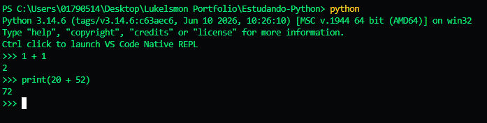

  

<h1 align="center">
    Olá! 🍀
</h1>

Neste repositório eu estou tentando aprender mais sobre Python. 🍀

    
Ué, quem colocou essas flores verdes aqui no título?

 

    

     

    

        Ah, então foi você Verde🍀? Bem, bom ter você aqui, se importaria de nos ajudar neste repositório?
        
    

    

        Que ótimo! Bem, seremos abençoados com a presença de Verde🍀 para nos ajudar, por favor aproveitem o repositório caso queiram ler e dêem oi para Verde🍀 também!
    

    

---

    <h3>
        Deseja acessar o modo interativo do Python?
    </h3>
    

        Basta colocar os seguintes comandos:
    

 

1. Abra seu terminal no VS Code
2. > E digite "python"
 

3. 

    

    > Ou pode digitar executando a script: flag -i (python -i app.py)

4. 

    Para sair deste modo, digite: 
    > exit()

